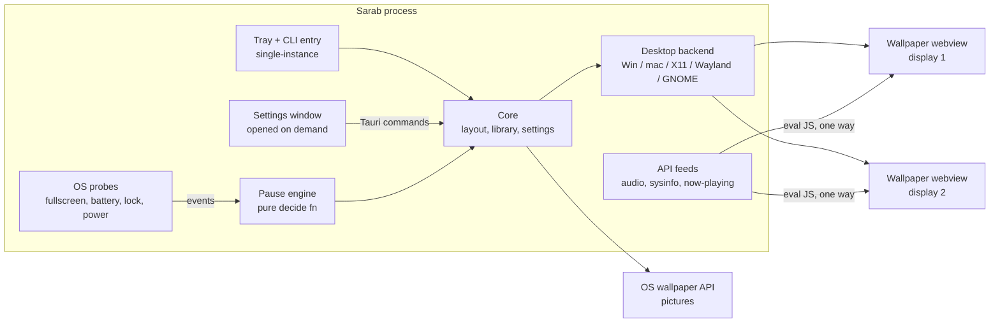

# Sarab: system design

Companion docs: [SPEC.md](SPEC.md) (what it must do) · [PLAN.md](PLAN.md) (order of work).

---

## 1. Stack decision

**Rust + Tauri v2**, with the **system webview** as the renderer.

| Option | Verdict | Reason |
|---|---|---|
| **Rust + Tauri v2** | **Chosen** | Native binary (~5 to 10 MB). Uses the webview the OS already ships (WebView2 / WKWebView / WebKitGTK), so no bundled Chromium. Tray, windows, single-instance, autostart and installers (`.msi`, `.dmg`, `.deb`, `.rpm`, `.AppImage`) come ready-made. Direct access to Win32 / AppKit / X11 / Wayland through mature crates. Cargo keeps one build tool on all three OSes. |
| C++ + Qt (QtWebEngine) | Rejected | QtWebEngine bundles Chromium (~150 MB, heavy RAM). Build/packaging across 3 OSes is more work. More memory-safety bugs to own. |
| C++ + raw platform APIs | Rejected | Three separate UI and webview integrations to write and maintain. |
| Electron | Rejected | ~100 to 200 MB RAM before any wallpaper loads. Fails the old-laptop goal. |
| Go / Zig | Rejected | Weak desktop-window and webview ecosystem. |
| C# / .NET | Rejected | Avalonia is cross-platform, but desktop embedding and webviews still need per-OS glue, and the runtime is heavier than a Rust binary. |

The rule this stack follows: **the OS already has a hardware video decoder, a compositor and a browser engine. Sarab mostly places a window and decides when it may run.**

---

## 2. Architecture



- **One process.** The wallpaper webviews are windows owned by this process. The webview engines already run their renderers out of process, so a crashing page doesn't take the app down.
- **Wallpaper windows get no IPC.** Data flows host → page only, by evaluating JS. Pages cannot call Tauri commands (see §8).
- **Settings window is created on open and destroyed on close.** When the user isn't looking at it, it costs nothing.
- **No RPC layer, no watchdog process, no per-wallpaper player executables.**

---

## 3. Repository layout

```
sarab/
├─ src-tauri/
│  ├─ Cargo.toml
│  ├─ tauri.conf.json
│  ├─ capabilities/main.json        # commands allowed for the "main" (settings) window only
│  └─ src/
│     ├─ main.rs                    # setup: tray, single-instance, CLI dispatch, event loop
│     ├─ cli.rs                     # argv → Command enum
│     ├─ settings.rs                # Settings + Layout structs, atomic JSON load/save
│     ├─ library.rs                 # scan, add, import Sarab zip, export, thumbnails
│     ├─ wallpaper.rs               # apply/close per display, window lifecycle, JS bridge
│     ├─ pause.rs                   # Signals → decisions (pure) + tests
│     ├─ feeds.rs                   # audio FFT, sysinfo, now-playing → JS calls
│     ├─ inject.js                  # rAF throttle, freeze/unfreeze, video sync (include_str!)
│     └─ os/
│        ├─ windows.rs              # WorkerW embed + probes + GSMTC
│        ├─ macos.rs                # desktop-level window + probes
│        ├─ x11.rs                  # desktop-type window + probes
│        └─ wayland.rs              # layer-shell + foreign-toplevel + probes
├─ ui/                               # settings/library window: plain HTML/CSS/JS, no framework, no bundler
│  ├─ index.html  app.js  style.css
│  └─ player.html                    # tiny page that plays one video/gif/image with object-fit
├─ gnome-extension/                  # ~150 lines JS, places Sarab windows in GNOME's background group
│  ├─ metadata.json  extension.js
├─ packaging/aur/PKGBUILD
└─ .github/workflows/release.yml     # tauri-action matrix build
```

One crate. Platform code selected with `#[cfg(target_os = ...)]`; Linux picks X11 vs Wayland at runtime from `WAYLAND_DISPLAY` / `XDG_SESSION_TYPE`. Split into a workspace only if compile times hurt.

---

## 4. Rendering

| Wallpaper type | How it is shown | Pause behaviour |
|---|---|---|
| `picture` | OS wallpaper API. No window at all. | Nothing to pause |
| `video` | `ui/player.html?src=…` in the wallpaper webview: `<video autoplay loop muted playsinline>` with `object-fit` from settings | `video.pause()` |
| `gif` | Same player page, `` | Swap to a paused state (hide ``, show a captured first frame) |
| `web` | Wallpaper folder's `index.html` | See §5 |
| `url` | The URL directly (after Shadertoy/YouTube rewrite) | See §5 |
| `app` (Phase 5) | Native window reparented under the desktop | Windows: `NtSuspendProcess`; X11: `SIGSTOP` |

### Serving files
- Media files and wallpaper folders are served through **Tauri's asset protocol**. Its scope is empty at start and each wallpaper's folder/file is allowed at runtime (`asset_protocol_scope().allow_directory(..)`) when applied. Nothing else on disk is reachable.
- The asset protocol handles HTTP `Range` requests. WebKit (macOS, Linux) needs that for `<video>` to play and seek.
- No `file://` URLs.

### Hardware video decode
- Windows: WebView2 → Media Foundation → GPU decoder (H.264, HEVC if the OS extension is installed, VP9, AV1 on newer GPUs).
- macOS: WKWebView → AVFoundation → VideoToolbox. Very efficient.
- Linux: WebKitGTK → GStreamer. Hardware decode needs the VA plugin (`gst-plugins-bad` `va` element, or `gstreamer1.0-vaapi` on older Ubuntu). **Phase 0 measures this.** If it misses the budget, add an **mpv backend for Linux only**: X11 embeds mpv with `--wid=<xid>`; Wayland runs `mpvpaper` if installed. Start with these mpv flags: `--hwdec=auto-safe --loop-file --no-osc --input-default-bindings=no --input-ipc-server=<sock>`.

### Power levers (all cheap to build)
1. **FPS cap**: `inject.js` wraps `requestAnimationFrame` and only calls callbacks every `1000/fps` ms. Covers canvas/WebGL wallpapers, which are the heavy ones.
2. **Freeze**: the same wrapper stops calling callbacks, plus injected CSS `*{animation-play-state:paused!important}` and `media.pause()` for all `<video>/<audio>`.
3. **No hiding.** An earlier build hid covered wallpapers and suspended WebView2 (`TrySuspend`). Users then saw the plain Windows wallpaper whenever the covering app minimized, alt-tabbed or was see-through, and for up to a second after it left. Freezing already measured 0.0039 CPU cores (G7), so hiding was dropped.
4. **Unload** after long pause (SPEC F17): navigate to `about:blank`, reload on resume.
5. **Picture fallback**: pictures never start a webview.

---

## 5. Pause engine

### Two pause states, one behaviour
| State | Used when | What happens |
|---|---|---|
| **Covered** | Display covered (fullscreen / maximized), screen locked, remote session | Freeze in place (lever 2). The window stays shown (see lever 3) |
| **Frozen** | Battery, energy saver, app rule, focus rule, manual | Freeze in place (lever 2) |

The two states differ only in the reason shown in the UI and the log.

Both fire `sarabPlaybackChanged({paused: true})` so wallpapers that do their own work (timers, WebSockets) can stop.

### Decision function (pure, unit-tested)
```rust
pub struct Signals {
    pub manual: Option<bool>,          // Some(true)=paused, Some(false)=force play
    pub on_battery: bool,
    pub power_saver: bool,
    pub locked_or_asleep: bool,
    pub remote_session: bool,
    pub foreground_app: Option<String>, // process name / app_id
    pub displays: Vec<DisplaySignal>,
}
pub struct DisplaySignal { pub id: DisplayId, pub fullscreen: bool, pub covered: bool, pub desktop_focused: bool }

pub enum State { Play, Frozen, Covered }

pub fn decide(s: &Signals, r: &Rules) -> Vec<(DisplayId, State)>;
```
Order of precedence: manual → locked/remote (Covered, all) → app rules → per-display fullscreen/covered (Covered) → battery / power saver / focus rule (Frozen) → Play. `per display` vs `all displays` is one rule flag applied at the end. Span layout pauses only when every display says pause.

The core applies a decision only when it differs from the current one, so a probe firing twice is harmless.

### Probes per platform
Event-driven where the OS offers it. A **1 s poll** covers the rest (1 s meets the "≤ 1 s" budget and halves wakeups).

| Signal | Windows | macOS | Linux X11 | Linux Wayland |
|---|---|---|---|---|
| Fullscreen app | `SHQueryUserNotificationState` (D3D fullscreen, busy, presentation) + per-monitor rect check | Our own window's `occlusionState` notification (free, event) + `CGWindowListCopyWindowInfo` bounds for per-display | `_NET_WM_STATE_FULLSCREEN` on `_NET_ACTIVE_WINDOW` (PropertyNotify on root) | wlroots/Hyprland: `zwlr_foreign_toplevel_manager_v1` state. GNOME: our extension reports it over D-Bus. KDE: KWin script over D-Bus (best effort) |
| Covered by windows | `EnumWindows` + `DwmGetWindowAttribute(DWMWA_CLOAKED)` + rect vs monitor, skip `Progman`/`WorkerW`/`Shell_TrayWnd`. Polled | Occlusion notification | `_NET_CLIENT_LIST_STACKING` geometries. Polled | maximized/fullscreen flags from foreign-toplevel |
| Battery | `GetSystemPowerStatus` + `WM_POWERBROADCAST` | `IOPSNotificationCreateRunLoopSource` | UPower D-Bus `OnBattery` (fallback `/sys/class/power_supply`) | same |
| Energy saver | `GetSystemPowerStatus().SystemStatusFlag` | `NSProcessInfo.lowPowerModeEnabled` + notification | power-profiles-daemon `ActiveProfile == "power-saver"` | same |
| Lock / display sleep | `WTSRegisterSessionNotification`, `GUID_CONSOLE_DISPLAY_STATE` | `com.apple.screenIsLocked` distributed notification, `NSWorkspaceScreensDidSleep` | logind `LockedHint`, `org.freedesktop.ScreenSaver.ActiveChanged` | same |
| Remote session | `GetSystemMetrics(SM_REMOTESESSION)` + WTS events |, |, |, |
| Foreground app name | `GetForegroundWindow` → pid → `QueryFullProcessImageNameW` | `NSWorkspace.frontmostApplication` | `_NET_WM_PID` → `/proc/<pid>/comm` | foreign-toplevel `app_id` |

Probes send `Signal` changes into one `std::sync::mpsc` channel; a single thread owns `Signals`, calls `decide`, and dispatches to the main thread. No async runtime needed for this (Tauri brings tokio anyway for commands; don't spread it).

---

## 6. Desktop backends

Each backend exposes the same four functions, as plain `#[cfg]` modules, no trait (one implementation per build):

```rust
fn attach(window: &WebviewWindow, display: &Display) -> Result<()>;  // place under icons
fn detach(window: &WebviewWindow);
fn set_picture(path: &Path, display: Option<&Display>) -> Result<()>;
fn watch_shell_restart(tx: Sender<Event>);                           // re-attach on Explorer/Finder/compositor restart
```

### Windows (10 1903+ / 11)
1. `SendMessageTimeout(Progman, 0x052C, 0xD, 0x1)` spawns the `WorkerW`.
2. **Classic** (Win10, Win11 pre-24H2): `EnumWindows` → find the top-level window containing `SHELLDLL_DefView` → the next `WorkerW` sibling is the target. `SetParent(hwnd, workerw)`.
3. **Raised desktop** (Win11 24H2+, detected by `WS_EX_NOREDIRECTIONBITMAP` on Progman): parent to **Progman**, z-order the wallpaper **below `SHELLDLL_DefView` and above the `WorkerW`** with `SetWindowPos`.
4. Position with monitor rects in physical pixels (Tauri is per-monitor-DPI-aware v2). Convert to WorkerW client coordinates with `MapWindowPoints` (multi-monitor virtual desktop can start at negative coordinates).
5. Explorer restart: listen for the registered `TaskbarCreated` message and a `WinEvent` hook on WorkerW destroy → re-run 1 to 3.
6. Clean exit: close windows, then `SystemParametersInfoW(SPI_SETDESKWALLPAPER, …, current_wallpaper)` to repaint the desktop. After a crash the next start does the same.
7. Pictures: `IDesktopWallpaper::SetWallpaper(monitor_id, path)` (per monitor).

### macOS (12+)
- From `window.ns_window()`: `setLevel(CGWindowLevelForKey(kCGDesktopWindowLevelKey))`, `setCollectionBehavior(canJoinAllSpaces | stationary | ignoresCycle)`, `setIgnoresMouseEvents(true)`, borderless, `hasShadow = false`, frame = `NSScreen.frame`.
- Finder icons draw above desktop level, so they stay visible and clickable.
- App runs with `ActivationPolicy::Accessory` (no Dock icon) while the settings window is closed.
- Pictures: `NSWorkspace.setDesktopImageURL(_:for:options:)` per screen.
- Shell restart: nothing to do. The window belongs to us, not Finder.

### Linux Wayland: wlroots, KDE Plasma 6, COSMIC, Hyprland, niri
- Tauri on Linux uses GTK3. Create the wallpaper window **hidden**, get `gtk_window()`, call `gtk_layer_shell::init_for_window`, set layer `Background`, anchor all four edges, exclusive zone `-1`, keyboard mode none, output = target monitor, then show.
- **Spike risk:** layer-shell must be initialised before the window is mapped. If Tauri maps it too early, build wallpaper windows directly with `gtk::Window` + `wry::WebViewBuilder::build_gtk(&container)` (wry is already a dependency through Tauri). Phase 0 decides.
- Input: the background surface gets pointer events when nothing covers it. No global hook needed.
- Pictures: layer-shell window showing the image (compositors have no common wallpaper API). A static `` in a frozen page costs ~0 CPU.

### Linux Wayland: GNOME (Ubuntu default)
GNOME does not implement layer-shell. Ship `gnome-extension/`:
- On `window-created`, match `wm_class == "sarab-wallpaper"`, move its actor into `Main.layoutManager._backgroundGroup`, keep it out of the taskbar, alt-tab and overview, and size it to its monitor.
- Expose `org.sarab.Shell` on D-Bus: `FullscreenChanged(monitor, bool)` from `global.display` `in-fullscreen-changed`. That gives GNOME the best fullscreen detection of any Linux desktop.
- Pictures: `gsettings set org.gnome.desktop.background picture-uri(-dark) file://…` (no extension needed).
- Extensions break across GNOME versions. Support the versions shipped by current Ubuntu LTS + latest; test in CI with a nested `gnome-shell --nested` where possible.

### Linux X11 (any EWMH WM)
- Set `_NET_WM_WINDOW_TYPE_DESKTOP`, `_NET_WM_STATE_BELOW | STICKY | SKIP_TASKBAR | SKIP_PAGER` with `x11rb` before mapping, geometry = monitor rect (XRandR).
- Desktops that draw their own desktop window (KDE X11, XFCE with icons) may stack theirs above ours. Documented as best effort. The picture fallback still works through the `wallpaper` crate / DE-specific commands.

---

## 7. Data and storage

| File | Location | Content |
|---|---|---|
| `settings.json` | config dir | rules, fps cap, low-power profile, volume, autostart, input forwarding, language |
| `layout.json` | config dir | `[{display_key, wallpaper_id, arrangement}]` |
| `props/<wallpaper_id>/<display_key>.json` | config dir | Saved `properties.json` values |
| `Library/<id>/sarab.json` (+ files) | data dir | Wallpapers, Sarab package format |

Config dir: `%APPDATA%\com.mkabumattar.sarab` · `~/Library/Application Support/com.mkabumattar.sarab` · `$XDG_CONFIG_HOME/com.mkabumattar.sarab`. Data dir: `%LOCALAPPDATA%\com.mkabumattar.sarab` · same as config on macOS · `$XDG_DATA_HOME/com.mkabumattar.sarab`. Named after the app identifier, as Tauri does, so they never collide with the per-user install folder (`%LOCALAPPDATA%\Sarab`) and the uninstaller's "delete app data" option finds them.

- `display_key` = monitor device path / EDID-based name, not index, so layouts survive reordering. Index is only used on the CLI.
- All writes: serialize → `*.tmp` → `fs::rename`. Unknown JSON fields are ignored on read (`#[serde(default)]`) so old/new versions coexist.
- Library scan = read each `sarab.json` once at start, keep in memory. No database.

---

## 8. Web API bridge

`inject.js` is added as an initialization script to every wallpaper webview. It:
1. Wraps `requestAnimationFrame` for FPS cap and freeze (§4).
2. Defines `window.__sarab = { freeze(), unfreeze(), setFps(n) }`. The host calls these via `webview.eval()`.
3. Defines `__sarab.time()` and `__sarab.follow()`, which keep the same video in step across displays.

Host → page calls go through one function in `wallpaper.rs`:
```rust
fn call(win: &WebviewWindow, func: &str, args: &[serde_json::Value]) {
    let a = args.iter().map(|v| v.to_string()).collect::<Vec<_>>().join(",");
    let _ = win.eval(&format!("typeof {func}==='function'&&{func}({a})"));
}
```
`serde_json` produces valid JS literals, so page-controlled strings never break out. `func` is always one of our fixed names.

Feeds only run while at least one playing wallpaper asked for them (flags in `sarab.json`):
| Feed | Source | Rate |
|---|---|---|
| Audio | `cpal` WASAPI loopback (Windows); PulseAudio/PipeWire monitor `@DEFAULT_MONITOR@` via `libpulse-simple` (Linux); ScreenCaptureKit audio, macOS 13+, needs Screen Recording permission (Phase 4, optional). 256-sample FFT (`rustfft`) → 128 bins, log-scaled, smoothed | 30 Hz |
| System info | `sysinfo` crate (CPU, RAM, network). GPU name only | 1 Hz |
| Now playing | Windows GSMTC (`windows` crate). Linux MPRIS (`zbus`). macOS: not available to third-party apps since 15.4, send `null` | On change |

### Isolation (security)
- `capabilities/main.json` grants commands to the window labelled `main` only. Wallpaper windows (`wp-<display>`) match no capability, so `window.__TAURI__` IPC calls are rejected.
- Remote URLs (`url` type) get no capability either (Tauri denies remote origins by default).
- Navigation handler: `web` wallpapers may not navigate the top frame away from their own origin. New-window requests are opened in the system browser, or dropped.
- Zip import: `zip` crate, use `enclosed_name()` for every entry (rejects `..` and absolute paths), stop past the size cap.

---

## 9. Interaction forwarding (Phase 4)

One code path everywhere: when the cursor is over the bare desktop, send synthetic DOM events into the page with `__sarab.pointer(x, y, type)` → `document.elementFromPoint(x,y).dispatchEvent(new PointerEvent(...))` plus `mousemove` on `window`. Covers parallax, hover and click wallpapers. `isTrusted` is false, which few wallpapers check.

| OS | Cursor source | "Over desktop?" check |
|---|---|---|
| Windows | `SetWindowsHookEx(WH_MOUSE_LL)` | `WindowFromPoint` class is `SysListView32` / `SHELLDLL_DefView` / `WorkerW` / `Progman` |
| macOS | `NSEvent.addGlobalMonitorForEvents(mouseMoved, leftMouseDown/Up)` (no Accessibility permission needed for mouse) | No window with layer 0 at the point (`CGWindowListCopyWindowInfo`, checked on click only) |
| X11 | XInput2 raw motion/button on root | `XQueryPointer` child is none or the desktop window |
| Wayland | Native pointer events on the layer surface | Implicit |

Hooks are installed only while an interactive wallpaper is playing and forwarding is enabled; mouse-move events are coalesced to the FPS cap.

---

## 10. App/game wallpapers (Phase 5)

- Windows: spawn inside a **Job Object** with `JOB_OBJECT_LIMIT_KILL_ON_JOB_CLOSE`, so children die with Sarab (no watchdog process needed). Unity: pass `-parentHWND <hwnd>`. Others: wait up to 20 s for the pid's main window, strip caption/border styles, `SetParent` to the host.
- X11: `prctl(PR_SET_PDEATHSIG, SIGKILL)` in `pre_exec`; find the window by `_NET_WM_PID`, `XReparentWindow`.
- Wayland, macOS: not supported. Neither lets one app take another app's window.

---

## 11. CLI

`tauri-plugin-single-instance` hands the second process's `argv` to the running instance, which parses it with `cli.rs` into:
```rust
enum Command { Set { target: String, display: Option<usize> }, Close { display: Option<usize> },
               Pause, Resume, Toggle, Prop { key: String, value: String, display: Option<usize> },
               Volume(u8), Next, ShowUi }
```
Hand-written parser over `std::env::args` (≈ 60 lines). No `clap` until the CLI grows. The second process exits immediately. No reply channel in v1. Add a local socket when a `status` command is needed.

---

## 12. Dependencies

Kept small on purpose. Each needs a reason.

| Crate | Why |
|---|---|
| `tauri` 2 (+ `tray-icon` feature) | Windows, webview, tray, bundler |
| `tauri-plugin-single-instance` | One instance + CLI forwarding |
| `tauri-plugin-autostart` | Login start on all 3 OSes |
| `serde`, `serde_json` | Settings, package files, JS args |
| `zip` | Import/export |
| `windows` (Win only) | Win32, WebView2 COM, IDesktopWallpaper, GSMTC |
| `objc2`, `objc2-app-kit`, `objc2-foundation` (mac only) | NSWindow level, notifications, NSWorkspace |
| `gtk-layer-shell` (Linux) | Wayland background layer |
| `x11rb` (Linux) | EWMH desktop window, probes |
| `wayland-client`, `wayland-protocols-wlr` (Linux) | foreign-toplevel fullscreen state |
| `zbus` (Linux) | UPower, logind, power-profiles, MPRIS, GNOME extension |
| `sysinfo` | System info feed (Phase 4) |
| `cpal`, `rustfft`, `libpulse-simple-binding` (Linux) | Audio feed (Phase 4) |

Not added: an async runtime of our own, a logging framework (`eprintln!` + a log file opened in `main`), an HTTP client (update check = let the settings page `fetch()` the GitHub releases API), a UI framework.

---

## 13. Build, packaging, release

- GitHub Actions matrix with `tauri-apps/tauri-action`: `windows-latest` (msi + nsis), `macos-latest` (universal dmg, signed + notarized), `ubuntu-22.04` (deb, rpm, AppImage; building on the oldest supported glibc keeps them working on newer distros).
- Windows: WebView2 is preinstalled on Windows 11 and current Windows 10. Installer uses `webviewInstallMode: downloadBootstrapper` for older machines.
- Linux runtime deps: `libwebkit2gtk-4.1-0`, `libgtk-3-0`, `libayatana-appindicator3-1`, `libgtk-layer-shell0`, GStreamer base/good/bad + VA plugin (recommended, not required).
  - Ubuntu/Debian: `.deb` declares these.
  - Fedora/openSUSE: `.rpm`.
  - Arch/Manjaro/EndeavourOS: AUR `sarab-bin` PKGBUILD wrapping the release binary.
  - Everything else: `.AppImage`. Flatpak later (layer-shell and X11 work inside Flatpak; the GNOME extension is installed separately).
- Version = git tag. Update check: settings page compares against the latest GitHub release and shows a link. No auto-update in v1.

---

## 14. Testing

- `pause.rs`: `#[cfg(test)]` table of `Signals → expected decisions` (≈ 20 cases: every rule, precedence, span vs per-display). This is where the logic lives, so this is where the tests go.
- `library.rs`: one test that imports a zip containing `../evil` and asserts it is rejected, one that round-trips a Sarab package zip.
- `cli.rs`: one test over sample argv lists.
- Platform backends: manual acceptance list from SPEC §8 on real machines (Windows 10, Windows 11 24H2, macOS, Ubuntu GNOME Wayland, Arch + Hyprland, Fedora KDE, one X11 WM). Emulated CI can't prove "sits under the icons".
- Performance: a script per OS samples the app's CPU/RAM for 60 s (`typeperf` / `top -l` / `pidstat`) and prints the numbers checked against SPEC §7.1.

---

## 15. Risks

| Risk | Impact | Mitigation |
|---|---|---|
| Windows changes WorkerW behaviour again (as in 24H2) | Wallpaper disappears or covers icons | Keep both embed paths, detect by window styles not OS version |
| Tauri maps the GTK window before layer-shell init | No Wayland support via Tauri windows | Fallback: raw `gtk::Window` + `wry` (§6). Decided in Phase 0 |
| WebKitGTK video decode is software-only on the user's distro | High CPU on Linux video | Detect VA plugin at start and warn; mpv backend (§4) |
| GNOME extension API breaks each release | Ubuntu users lose animated wallpapers | Keep the extension tiny; version-gate in `metadata.json`; picture fallback always works |
| Webview RAM (~80 to 150 MB per display) on 4 GB machines | Memory pressure | One shared webview environment across windows (Tauri default), unload after long pause (F17), duplicate mode on 2+ displays can reuse one video decode later if measured as needed |
| macOS private-API changes (now playing) | Missing feed | Already out of scope on macOS |
| Wallpaper pages misbehave (infinite loops, huge memory) | App looks slow | FPS cap, freeze, per-wallpaper "reload" and "disable" in UI. The page runs in the webview's renderer process, so Sarab itself stays responsive |
